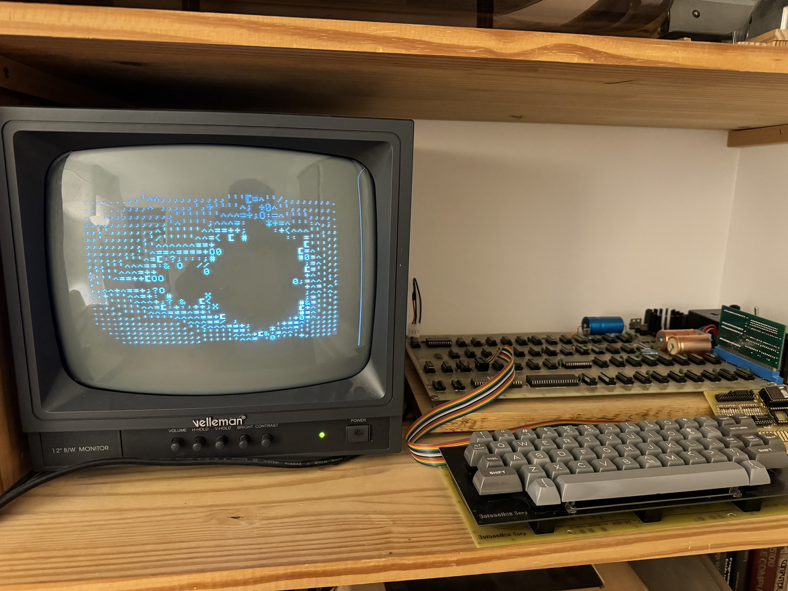

# An 6502 assembly Mandelbrot drawing for the Apple1

The title says it all. This is the fastest Mandelbrot calculator for the Apple1. At minimum zoom, it computes the Mandelbrot set as fast as the Apple1 can display it (16.7 seconds per image)

# How do I get it?

This demo as been designed for Aberco/SiliconInsider Apple1 ROM card.

If you want to use the demo standalone, use either the binary file:

[mandelbrot65.o65](mandelbrot65.o65) or the [hex file](mandelbrot65.hex). You can copy/paste the hex file on an [Apple1 emulator](https://www.scullinsteel.com/apple1/).

# How do I run it?

The demo is made to be loaded at address 0x0280 and run with a ``280R`` (or launched from the menu of the Apple1 1 ROM card).

You will need 8K of RAM between 0000-1FFF to run it.

The demo will wait for a key press (to initialize its internal random number generator) then draw a Mandelbrot set and perform a series of 4 level of zooms.

Press a key to skip messages or mandelbrot displays.

# How do I build it?

Use the xa assembler and the top level Makefile.

``make`` will make the binary and the hex file.
``make mandelbrot.o65`` will make the binary only.
``make clean`` to remove binaries and compilation artificats.

The content of ``others`` directory contains a C++ program that was used to validate during the development. It is trash undocumented code (but had been very helpful).

# Why did you do this?

We wanted to include a Mandelbrot demo on the ROM card, but the existing demos were using AppleSoft Basic, which will not be present on the 32K version of the card. I wasn't able to find a good version of Mandelbrot, so decided to write one.

(I will later document the journey on http://stark.fr/blog/mandelbrot65)
